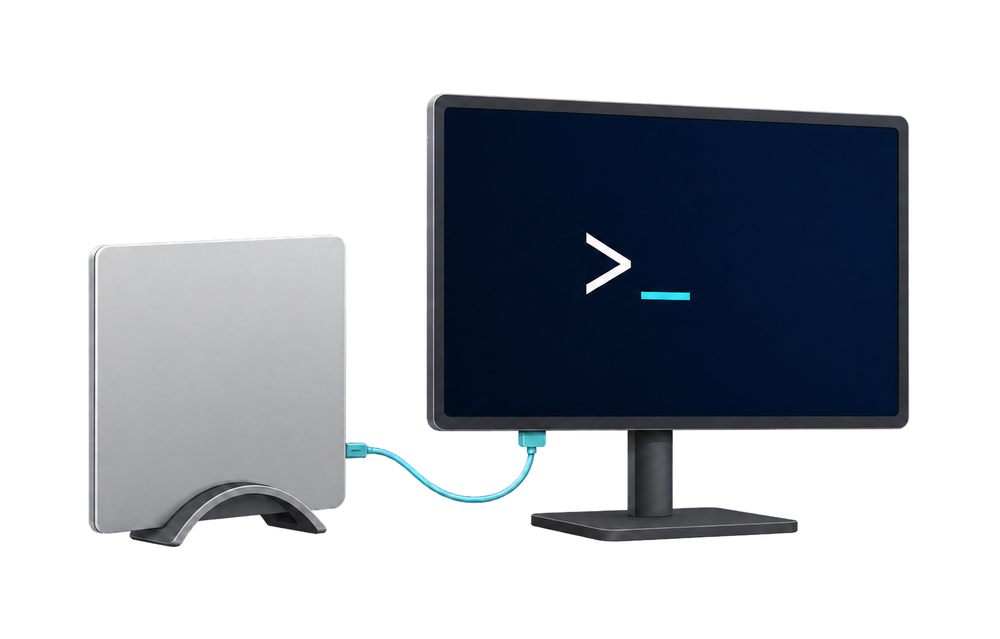

<p align="center">
  
</p>

# clamshellctl

Control battery clamshell mode on macOS.

> [!IMPORTANT]
> `clamshellctl` is under active development and is not ready to install. The
> repository does not yet publish a Homebrew formula or companion-app DMG.

## What it will provide

- A terminal-first `clamshellctl` command installed through Homebrew.
- Verified `status`, `enable`, `disable`, and `toggle` operations.
- Optional temporary enablement with automatic disablement.
- A self-contained macOS companion app with a stateful Control Centre toggle.
- One explicit administrator-authorised setup step, followed by narrowly
  restricted password-free operations.

The CLI will support macOS 13 and later. The optional native companion will
require macOS 26 or later because that is where WidgetKit controls became
available on Mac.

## Safety model

The project changes only the Battery Power `disablesleep` setting. It does not
change the corresponding AC Power setting.

Normal mutations will pass through a root-owned helper that accepts only the
exact `enable` and `disable` operations. The sudoers policy will grant no
password-free access to the public CLI, app bundle, arbitrary `pmset`
arguments, or a shell. After each mutation, `clamshellctl` will reread `pmset`
before reporting success.

See the [design](docs/clamshellctl-design.md) for the complete privilege and
component boundaries.

## Project status

The package foundation is in place. The
[implementation plan](docs/implementation-plan.md) tracks the remaining work.
Each behaviour will have automated tests before the repository publishes
installation instructions.

## Development

Requirements:

- macOS
- Xcode 26.6 or later
- Swift 6.3 or later

Run the current checks with:

```bash
swift test
swift build -c release
```

## Licence

`clamshellctl` is available under the [MIT License](LICENSE).
